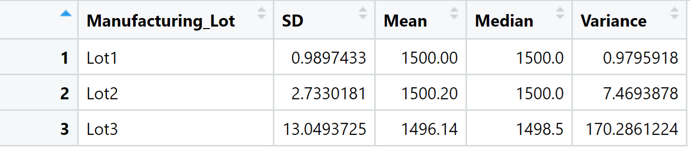

# MechaCar_Statistical_Analysis

## Project Overview
AutosRUs’ newest prototype, the MechaCar, is suffering from production troubles that are blocking the manufacturing team’s progress. AutosRUs’ upper management has our team to review the production data for insights that may help the manufacturing team.

## Linear Regression to Predict MPG

- Vehicle weight, spoiler_angle and AWD are  rovided a non-random amount of variance to the mpg values in the dataset

-The slope of the linear model is not zero, becouse p-value is less than 0.05.

- The linear model predicts mpg of MechaCar prototypes in 71% which is accurate.

## Study Design: MechaCar vs Competition
A linear regression on everyday fuel economy is a research that intends to compare MechaCar and competitors. With the high gasoline prices and alternatives such as electric cars and other electric personal transport high MPG is a manfotory for manufactures if they want to succeed in sales. In addition SUV's sales have skyrocketed recently which means MPG and car size are the most important aspects for buying a new car. We can do a t-test to compare all types of competitor vehicles.
